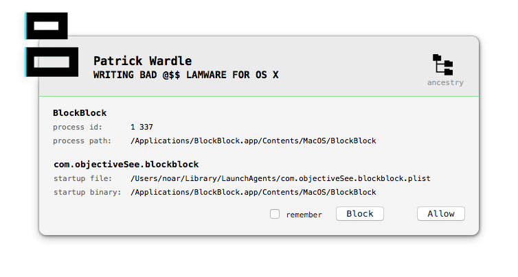
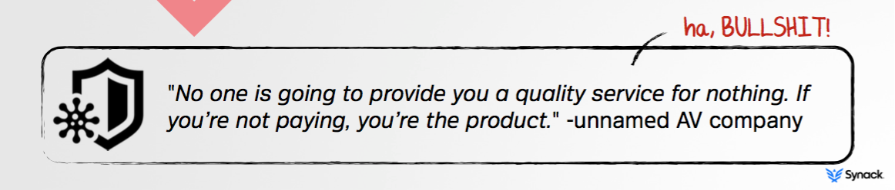

## WRITING BAD @$$ LAMWARE FOR OS X

I remember those days when there were only 3 or 4 security software editors for OS X. As the threat counts increased, the market grew up too. Many products are now selling you a feeling of being secure: most of them are post-mortem detection tools, and none is re-inventing the security paradigm.

This dinosaur fight left some room for an _altruistic_ new hype: free - but not open source - security tools. Should we trust them blindly?

_I am dedicating this post to HGDB, a former colleague and friend. Your sudden departure is leaving us in an infinite sadness. May you rest in peace._

### BlockBlock

So I had interest in reversing [Patrick Wardle](https://www.blackhat.com/us-15/briefings.html#patrick-wardle)'s [BlockBlock](https://objective-see.com/products/blockblock.html), a _continual runtime protection_ (see [WRITING BAD @$$ MALWARE FOR OS X](https://www.blackhat.com/docs/us-15/materials/us-15-Wardle-Writing-Bad-A-Malware-For-OS-X.pdf)).

BlockBlock has a weird design: the main binary is running both as a daemon and as an agent. The daemon waits for persistence related file system events and notifies the agent. The agent displays an alert and reports a user action to the daemon.

On the day BlockBlock was released, I pointed out several design flaws and how we can abuse them:

* [local privilege escalation](https://twitter.com/noarfromspace/status/601295636261171200), or how to fool installation process and enjoy being launched as root, quickly addressed (see [change log](https://objective-see.com/products/changelogs/BlockBlock.txt)).

* [insecure interprocess communication](https://twitter.com/noarfromspace/status/601344572162191360), using `NSDistributedNotificationCenter`.

* [user interface can be unloaded](https://twitter.com/noarfromspace/status/601301400841256960), by design.

### Insecure interprocess communication

As Apple clearly states in the [developer documentation](https://developer.apple.com/library/mac/documentation/Cocoa/Reference/Foundation/Classes/NSDistributedNotificationCenter_Class/index.html#//apple_ref/occ/cl/NSDistributedNotificationCenter):

> IMPORTANT
> 
> NSDistributedNotificationCenter does not implement a secure communications protocol. When using distributed notifications, your app should treat any data passed in the notification as untrusted. See Security Overview for general guidance on secure coding practices.

In practice, it's trivial to observe all distributed notifications, by setting _notificationName_ to `nil`:

	NSDistributedNotificationCenter *center = [NSDistributedNotificationCenter defaultCenter];
	
	[center addObserver:self selector:@selector(fyi:) name:nil object:nil suspensionBehavior:NSNotificationSuspensionBehaviorDeliverImmediately];

Let's snoop on daemon and agent distributed notifications, using [`notifyi`](https://github.com/melomac/notifyi), a very simple command line tool.

First, the daemon posts a `shouldDisplayAlertNotification` notification with a 16MB `processIcon` and an universal unique identifier `watchEventUUID`:

	2015-08-07 00:27:43.859 notifyi[365:3025] __CFNotification 0x7fcc53d00270 {name = shouldDisplayAlertNotification; userInfo = {
	    alertMsg = "installed a launch daemon or agent";
	    itemBinary = "/Users/noar/.launchd.app/Contents/MacOS/launchd";
	    itemFile = "/Users/noar/Library/LaunchAgents/apple.launchd.plist";
	    itemName = "apple.launchd";
	    parentID = 1;
	    pluginType = 2;
	    processHierarchy =     (
	                {
	            index = 0;
	            name = "kernel_task";
	            pid = 0;
	        },
	                {
	            index = 1;
	            name = launchd;
	            pid = 1;
	        },
	                {
	            index = 2;
	            name = launchd;
	            pid = 368;
	        }
	    );
	    processID = 368;
	    processIcon = <REDACTED>;
	    processLabel = launchd;
	    processName = launchd;
	    processPath = "/Users/noar/.launchd.app/Contents/MacOS/launchd";
	    targetUID = 501;
	    watchEventUUID = "7EADEED3-2E17-4060-AF9B-3B37357A07D6";
	}}

Then, the agent alerts the user and posts a `shouldHandleAlertNotification` notification with the same `watchEventUUID` and the `action` to take:

	2015-08-07 00:28:07.740 notifyi[365:3025] __CFNotification 0x7fcc53d00820 {name = shouldHandleAlertNotification; userInfo = {
	    action = 0;
	    remember = 0;
	    watchEventUUID = "7EADEED3-2E17-4060-AF9B-3B37357A07D6";
	}}

### What was blocked?

In this example, I pressed the _Block_ button, and BlockBlock deleted the reported `launchd.plist` file:

	$ find ~/Library/LaunchAgents -type f
	/Users/noar/Library/LaunchAgents/com.objectiveSee.blockblock.plist

But, amazingly, process 368 is still running:

	$ ps -p 368
	  PID TTY           TIME CMD
	  368 ??         0:00.57 /Users/noar/.launchd.app/Contents/MacOS/launchd

BlockBlock didn't unload the agent or kill the process. The threat will run until the user log-out (the sample here is `OSX.Icefog.A`).

### Proof of Concept

To bypass BlockBlock, ones would simply unload the agent.

We can also wait for an alert and silently whitelist us until the daemon restart:

* observe `shouldDisplayAlertNotification` notification;
* unload BlockBlock launch agent;
* post `shouldHandleAlertNotification` notification with _Allow_ and _Remember_ to daemon;
* reload BlockBlock launch agent.

The menu item quits and re-opens, no alert. POC source code is available on [GitHub](https://github.com/melomac/notifyi/tree/BlockBlock).

### So, what do we learn here?

Software you install, including those to protect your computer, increases its attack surface.

We have to stay humble and learn from mistakes: BlockBlock is not the only security software to use distributed notifications.

Last but not least, _providing quality service for nothing_ can't be a one person job. To save users from trusting security vendors, InfoSec free tools should be open source, so a strong community could audit and improve them.

